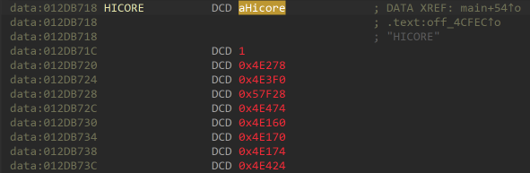

# Binary Analysis Report

## 1. Overview

***

This document is a report described by Team.ENVY (Kim Chan-in, Park Myung-hoon, Shin Myung-jin, Yang Gang-min, and Lee Yoo-kyung) who carried out the BoB 12th NVR Vulnability Analysis project.

### 1.1. Necessity

For the vulnerability analysis of Hikvision, analysis of the operation method of web services and web APIs is essential. Therefore, it is necessary to analyze the web service and web API operation method of Hikvision for vulnerability analysis.

## 2. sc\_hicore

***

### 2.1. main

```c
int __cdecl __noreturn main(int argc, const char **argv, const char **envp)
{
  int v5; // r1
  int v6; // r1
  int v7; // r1
  int v8; // r1
  int v9; // r1
  int v10; // r1
  int v11; // r1
  int v12; // r1
  int v13; // r1
  int v14; // r0

  remove("/home/app/exec/sc_hicore");
  sys_init(1);
  if ( sub_EC3CEC(argc, argv) )
  {
    HPR_MSleep(2000);
    _assert("0", "./slave.c", 26);
  }
  sub_EC34E8(&NETIF, v5);
  sub_EC34E8(&HICORE, v6);
  sub_EC34E8(&STORAGE, v7);
  sub_EC34E8(&GUI, v8);
  sub_EC34E8(&DVRLOG, v9);
  sub_EC34E8(&IPCM, v10);
  sub_EC34E8(&SURROT_ANR, v11);
  sub_EC34E8(&SADP, v12);
  sub_EC34E8(&UPNP, v13);
  sub_EC3650();
  v14 = th_check_sc_abnomal_thread_create();
  nullsub_37(v14);
  sub_F317C8();
}
```

If you check the result of the decompilation of the main function, the binary is deleted as soon as it is executed. Therefore, in order to extract the binary, you need to run the boot script one by one and copy the file to a different location before executing the binary.

In the main function, NETIF, HICORE, STORAGE, GUI, DVRLOG, IPCM, SURROT\_ANR, SADP, and UPNP are set after initializing the device and api used.

<figure><figcaption></figcaption></figure>

Each variable contains a function pointer, and the service is executed using a thread and a function pointer.

### 2.2. Web Service

```c
int dvr_startup_sc_web_server_start()
{
  int e; // r4
  char *v1; // r0
  char v3; // [sp+4h] [bp-1CCh]
  int array[114]; // [sp+8h] [bp-1C8h] BYREF

  memset(array, 0, 0x1C0u);
  if ( net_config(0, array, 1) )
  {
    if ( util_dbg_open(2, 0x20000, 4) )
      util_debug("init/dvr.c", 6203, "dvr_startup_sc_web_server_start", 2, "if_get_net_protocol_cfg failed!!\n");
    goto LABEL_5;
  }
  if ( !array[5] )
  {
LABEL_5:
    puts(">>here rest_srv_init");
    isapi_task_thread_create();
    return 0;
  }
  printf(">>bNetProtocolOk[%d] struNetProtocol.bHttp[%d]\n", 1, array[5]);
  if ( pthreadSpawn(0, 50, 0x20000, startHttpServer_thread, 0, v3) )
  {
    e = *_errno_location();
    v1 = strerror(e);
    sub_5CBB4("startHttpServer fail, errno = %d(%s)\n", e, v1);
  }
  return 0;
}
```

The function in which the service is first executed is as follows. In the function, isapi and HTTP server services are executed in threads.

#### 2.2.1. ISAPI

```c
void *isapi_task_thread_create()
{
  void *result; // r0
  const char *v1; // r0
  bool v2; // zf
  const char *v3; // r0
  bool v4; // zf
  int v5; // r0
  bool v6; // zf
  const char *v7; // r0
  bool v8; // zf
  _BOOL4 v9; // r0
  void *v10; // r0
  void *v11; // r0
  int v12; // r4
  char *v13; // r0
  void *v14; // r0
  void *v15; // r0
  int v16; // r4
  char *v17; // r0
  char v18; // [sp+4h] [bp-1ECh]
  int v19; // [sp+14h] [bp-1DCh] BYREF
  int v20; // [sp+18h] [bp-1D8h] BYREF
  int v21; // [sp+1Ch] [bp-1D4h] BYREF
  int s[116]; // [sp+20h] [bp-1D0h] BYREF

  v19 = 0;
  v20 = 0;
  v21 = 0;
  memset(s, 0, 0x1C0u);
  if ( net_config(0, s, 0) )
    sub_5CBB4("get net protocol cfg error!\n");
  if ( sub_1E1F8C("/upnpdevicedesc.xml", sub_1E6ABC, 0) && util_dbg_open(2, 4096, 4) )
    util_debug("rest_comm/comm/rest_main.c", 235, "upnp_srv_main", 2, "Register UPnP url error!\n");
  if ( s[6] == 1 )
    urlHandler();
  result = sdk_urlHandler();

...

				if ( dword_142B91C )
            {
              dword_142B920 = memalign(0x10u, 0xF00u);
              if ( dword_142B920 )
              {
                memset(dword_142B91C, 0, 0x2C00u);
                memset(dword_142B920, 0, 0xF00u);
                v11 = pthreadSpawn(0, 50, 0x4000, isapi_session_task_thread, 0, v18);

...

						v15 = pthreadSpawn(0, 50, 0x4000, isapi_intell_search_keep_task_thread, 0, v18);
            if ( v15 )
            {
              v15 = util_dbg_open(2, 4096, 4);
              if ( v15 )
              {
                v16 = *_errno_location();
                v17 = strerror(v16);
                v15 = util_debug(
                        "rest_comm/comm/rest_main.c",
                        471,
                        "rest_intell_search_resource_init",
                        2,
                        "isapi_fdlib_pic_searchId_task fail, errno = %d(%s)\n",
                        v16,
                        v17);
              }
            }
```

In the "isapi\_task\_thread\_create" function, handling for ISAPI and other url paths is set as follows, and the threads "isapi\_session\_task\_thread" and "isapi\_intell\_search\_keep\_task\_thread" are executed.

* url\_handler

```c
int urlHandlerSetting()
{
  sub_1E1F8C(off_12EADD4[0], isapiHandler);
  sub_1E1F8C(off_12EADD8[0], isapiHandler);
  sub_1E1F8C(off_12EADDC[0], isapiHandler);
  sub_1E1F8C(off_12EADE0[0], isapiHandler);
  sub_1E1F8C(off_12EADE4[0], isapiHandler);
  sub_1E1F8C(off_12EADE8, isapiHandler);
  sub_1E1F8C(off_12EADEC, isapiHandler);
  sub_1E1F8C(off_12EADF0[0], isapiHandler);
  sub_1E1F8C(off_12EADF4[0], isapiHandler);
  sub_1E1F8C("/ISAPI", isapiHandler);
  sub_1E1F8C("/picture", etcHandler);
  sub_1E1F8C("/pic", etcHandler);
  sub_1E1F8C("/FDLib", etcHandler);
  sub_1E1F8C("/PSIA/Custom/Event/notification/httpHost", isapiHandler);
  return sub_1E1F8C("/PSIA/Custom/HIK/dbg/", isapiHandler);
}
```

* sdk\_urlhandler

```c
int sub_2DECC4()
{
  sub_1E1F8C(off_130F738[0], isapiHandler, 1);
  sub_1E1F8C(off_130F73C[0], isapiHandler, 1);
  return sub_1E1F8C("/SDK", isapiHandler, 0);
}
```

#### 2.2.2. http server

In a function that first executes a web service (dvr\_startup\_sc\_web\_server\_start), the "startHttpServer\_thread" function is running as a thread, and again rides through several functions to execute a web service named "appweb" as a thread.

```c
int startHttpServer_thread()
{
  int v1; // r1
  int v2; // r2
  int array[9]; // [sp+4h] [bp-104h] BYREF
  char buf1[80]; // [sp+28h] [bp-E0h] BYREF
  char buf2[144]; // [sp+78h] [bp-90h] BYREF

  memset(buf2, 0, 0x80u);
  strcpy(buf2, "startHttpServer");
  strlen(buf2);
  pushPthreadInfo(buf2);
  while ( !sub_546310() )
    sleep(1u);
  if ( sub_F1AF54() )
    return puts("Can't create the web server root path!");
  snprintf(start_http_server_str, 0x50u, "%s", buf1);
  maybeStartHttps();
  memset(array, 0, sizeof(array));
  array[0] = start_http_server_str;
  array[1] = sub_1BF868;
  array[3] = getHttpsPort;
  array[4] = sub_1BF84C;
  array[5] = maybeStartHttps;
  array[6] = getHttpsCertFile;
  array[7] = getHttpsKeyFile;
  array[8] = maybeHttpsErrorCheck;
  taskAppWeb_thread_create(array, v1, v2);
  strlen(buf2);
  return sub_F123B0(buf2);
}
```

```c
int *__fastcall taskAppWeb_thread_create(int *httpsConfig, int a2, int a3)
{
  int *config; // r4
  int v4; // r0
  int v5; // r4

  if ( httpsConfig )
  {
    config = httpsConfig;
    memset(&dword_190BFA0, 0, 0x34u);
    dword_190BFB4 = config[1];
    dword_190BFBC = config[2];
    funcptr_getHttpsPort = config[3];           // getHttpsPort()
    dword_190BFC0 = config[4];
    funcptr_maybeStartHttps = config[5];        // maybeStartHttps
    funcptr_getHttpsCertFile = config[6];       // getHttpsCertFile
    funcptr_getHttpsKeyFile = config[7];        // getHttpsKeyFile
    dword_190BFB0 = *config;
    funcptr_maybeHttpsErrorCheck = config[8];   // maybeHttpsErrorCheck
    dword_142A7AC = -1;
    dword_142A7B0 = -1;
    dword_142A7B4 = -1;
    dword_142A7B8 = -1;
    v4 = sub_1D60E4(0, 0);
    v5 = v4;
    if ( v4 )
    {
      if ( sub_1D6350(v4, 0) >= 0 )
      {
        if ( sub_1D319C(v5, "taskAppWebStart", taskAppWeb_thread, v5, 50, 0, a3) )
        {
          *(v5 + 452) = 1;
          appweb_thread_create();
          while ( 1 )
            pause();
        }
        if ( util_dbg_open(2, 0x2000, 2) )
          util_debug("server/appweb.c", 661, "appWebStart", 2, "create web server task error!\n");
      }
      else
      {
        sub_1CF53C(v5, "Can't start the web server runtime");
      }
      return memoryAlloc(v5);
    }
    else
    {
      return sub_1CF53C(0, "Can't create the web server runtime");
    }
  }
  return httpsConfig;
}
```

* taskAppWeb\_thread

```c
int __fastcall taskAppWeb_thread(int result)
{
  int v1; // r8
  int auth; // r0
  int v3; // r7
  int v4; // r1
  int v5; // r2
  int v6; // r1
  int v7; // r2
  int v8; // r9
  int v9; // r4
  pthread_mutex_t *mutex1; // r0
  __suseconds_t v11; // r1
  int v12; // r2
  __int64 Time; // d8
  _DWORD *v14; // r0
  __suseconds_t v15; // r1
  int v16; // r2
  pthread_mutex_t *mutex2; // r0
  int v18; // r0
  int v19; // r1
  int v20; // r1
  __int64 v21; // r0
  int v22; // r11
  int v23; // r0
  int v24; // r11
  int port; // r11
  int v26; // r0
  int v27; // r9
  int v28; // r0
  int v29; // r9
  int HttpsPort; // r0
  int v31; // r0
  int v32; // r9
  int v33; // r0
  int v34; // r9
  int v35; // r0
  char *v36; // r0
  _DWORD *v37; // r0
  _DWORD *v38; // r10
  char *v39; // r0
  int v40; // r1
  int v41; // r2
  char *v42; // r9
  int v43; // r1
  int v44; // r2
  __int64 v45; // [sp+10h] [bp-C0h]
  int v46; // [sp+18h] [bp-B8h] BYREF
  int v47; // [sp+1Ch] [bp-B4h] BYREF
  char buf[176]; // [sp+20h] [bp-B0h] BYREF

  v1 = result;
  if ( result )
  {
    auth = readUserCredential(result);
    v3 = auth;
    if ( !auth )
      return sub_1CF53C(v1, "Can't create the web server http services");
    if ( sub_1BFE60(auth) )
    {
      if ( util_dbg_open(2, 0x2000, 2) )
        util_debug("server/appweb.c", 557, "taskAppWeb", 2, "Can't create the web server");
      return sub_1C2D10(v3, v6, v7);
    }
    if ( sub_1C2C70(v3, v4, v5) < 0 )
    {
      if ( util_dbg_open(2, 0x2000, 2) )
        util_debug("server/appweb.c", 562, "taskAppWeb", 2, "Can't start the web server");
      return sub_1C2D10(v3, v6, v7);
    }
    memset(buf, 0, 0x80u);
    strcpy(buf, "taskAppWeb");
    strlen(buf);
    pushPthreadInfo(buf);
LABEL_12:
    v8 = 0;
    v9 = sub_1CC21C();
    pthread_mutex_lock(*(v9 + 152));
    mutex1 = *(v9 + 152);
    *(v9 + 140) |= 3u;
    pthread_mutex_unlock(mutex1);
    Time = getTime(v9, v11, v12);
    *(v9 + 128) = Time;
    v45 = 0x7FFFFFFFFFFFFFFFLL;
    while ( 1 )
    {
      v14 = sub_1CC2B4(v9);
      if ( v14 )
      {
        sub_1D39A8(v14, 0);
      }
      else
      {
        if ( sub_1C9690() )
          goto LABEL_16;
        *(v9 + 128) = getTime(v9, v15, v16);
        v18 = sub_1CC3B8(v9);
        if ( v45 < v18 )
          v18 = v45;
        if ( v18 < 10000 )
          v19 = v18;
        else
          v19 = 10000;
        sub_1D6A38(*(dword_190BFD4 + 476), v19);
        v21 = sub_1D4224(v9, v20, Time, HIDWORD(Time), -1, 0x7FFFFFFF);
        v45 = v21;
        if ( v8 )
          goto LABEL_42;
        v22 = dword_190BFA0;
        v23 = dword_190BFB4(v21);
        if ( v22 != v23
          || (v24 = dword_190BFAC, v24 != dword_190BFC0(v23))
          || dword_190BFAC && (port = maybe_443port, port != funcptr_getHttpsPort()) )
        {
          if ( util_dbg_open(4, 0x2000, 2) )
            util_debug("server/appweb.c", 403, "isAppwebCfgChanged", 4, "@@@Appweb Configuration Changed:\n");
          v26 = util_dbg_open(4, 0x2000, 2);
          if ( v26 )
          {
            v27 = dword_190BFA0;
            v28 = dword_190BFB4(v26);
            util_debug("server/appweb.c", 404, "isAppwebCfgChanged", 4, "http  port   : %d-%d\n", v27, v28);
          }
          if ( util_dbg_open(4, 0x2000, 2) )
          {
            v29 = maybe_443port;
            HttpsPort = funcptr_getHttpsPort();
            util_debug("server/appweb.c", 405, "isAppwebCfgChanged", 4, "https port   : %d-%d\n", v29, HttpsPort);
          }
          v31 = util_dbg_open(4, 0x2000, 2);
          if ( v31 )
          {
            v32 = dword_190BFAC;
            v33 = dword_190BFC0(v31);
            util_debug("server/appweb.c", 406, "isAppwebCfgChanged", 4, "https enable : %d-%d\n", v32, v33);
          }
          goto LABEL_42;
        }
        if ( dword_190BFBC && dword_190BFBC() != dword_190BFA8 )
        {
          if ( util_dbg_open(4, 0x2000, 2) )
            util_debug("server/appweb.c", 415, "isAppwebCfgChanged", 4, "@@@Appweb Configuration Changed:\n");
          if ( util_dbg_open(4, 0x2000, 2) )
          {
            v34 = dword_190BFA8;
            v35 = dword_190BFBC();
            util_debug("server/appweb.c", 416, "isAppwebCfgChanged", 4, "http  third  port   : %d-%d\n", v34, v35);
          }
LABEL_42:
          if ( sub_1C967C() )
            goto LABEL_16;
          if ( util_dbg_open(4, 0x2000, 2) )
            util_debug("server/appweb.c", 498, "appWebServiceEvents", 4, "@@@web server is busy, exit when it idle!\n");
          v8 = 1;
          sleep(1u);
        }
      }
      if ( v45 < 1 || sub_1C9690() )
      {
LABEL_16:
        pthread_mutex_lock(*(v9 + 152));
        mutex2 = *(v9 + 152);
        *(v9 + 140) &= 0xFFFFFFFC;
        pthread_mutex_unlock(mutex2);
        puts("@@@Appweb Restart!");
        v47 = 0;
        while ( 1 )
        {
          v39 = sub_1CD450(*(v3 + 8), &v47);
          v42 = v39;
          if ( !v39 )
            break;
          sub_1C2CB8(v39, v40, v41);
          sub_1CD684(*(v3 + 8));
          v46 = 0;
          while ( 1 )
          {
            v37 = sub_1CD450(*(v42 + 2), &v46);
            v38 = v37;
            if ( !v37 )
              break;
            v36 = v37[20];
            if ( v36 )
            {
              memoryAlloc(v36);
              v38[20] = 0;
            }
          }
          memoryAlloc(v42);
        }
        while ( sub_1BFE60(v3) )
          sleep(5u);
        while ( sub_1C2C70(v3, v43, v44) < 0 )
          sleep(5u);
        goto LABEL_12;
      }
    }
  }
  return result;
}
```

In the taskAppWeb\_thread function, sub\_1C2C70 → sub\_1C2B7C → sub\_1C1C18 → sub\_1D8FC4 → sub\_1D92D8 → sub\_1DDAAC (request\_handler) function is used to handle requests for client web connections.

The function parses the HTTP header and method as a function through which all web requests pass.

* request\_handler

```c
void __fastcall request_handler(int a1, int *a2)
{
  int v4; // r0
  int v5; // r7
  int v6; // r6
  int v7; // r0
  int v8; // r0
  int v9; // r7
  int v10; // r0
  int v11; // r3
  bool v12; // zf
  int v13; // r8
  int v14; // r9
  const char *v15; // r2
  const char *v16; // r0
  const char *v17; // r6
  int v18; // r8
  const char *v19; // r0
  const char *v20; // r10
  int v21; // r1
  const char *v22; // r11
  int v23; // r6
  _DWORD *v24; // r8
  int v25; // r11
  int v26; // r7
  int v27; // r9
  int v28; // r3
  _BYTE *v29; // r10
  unsigned int v30; // r10
  int v31; // r3
  int v32; // r0
  int v33; // r0
  int v34; // r7
  char *v35; // r6
  int v36; // r2
  int v37; // r3
  _BOOL4 v38; // r3
  const char *v39; // r6
  int v40; // r0
  int v41; // r6
  _DWORD *v42; // r5
  int v43; // r0
  char *v44; // r3
  _BYTE *v45; // r2
  int v46; // r3
  int v47; // r1
  signed int v48; // r10
  int v49; // r0
  int v50; // r0
  __int64 v51; // r2
  __int64 *v52; // r1
  int v53; // r0
  int v54; // r0
  int v55; // r0
  int v56; // r10
  _DWORD *v57; // r0
  int v58; // r0
  int v59; // r3
  __int64 v60; // [sp+18h] [bp-40h]
  int v61; // [sp+18h] [bp-40h]
  _BYTE *v62; // [sp+20h] [bp-38h]
  __int64 v63; // [sp+20h] [bp-38h]

  if ( !a1 )
    nullsub_5();
  *(a1 + 348) = 1;
  sub_1CEC94(a1, 7, "ENTER maProcessReadEvent state %d, packet %p", *(a1 + 4), a2);
LABEL_4:
  while ( *(a1 + 348) )
  {
    sub_1CEC94(a1, 7, "maProcessReadEvent, state %d, packet %p", *(a1 + 4), a2);
    switch ( *(a1 + 4) )
    {
      case 1:
        if ( !a2 )
          goto LABEL_81;
        v4 = a2[1];
        if ( !v4 )
          goto LABEL_81;
        v5 = sub_1CB7F8(v4);
        if ( !v5 )
          goto LABEL_81;
        v6 = sub_1CB828(a2[1]);
        v7 = sub_1D3040(v6, "\r\n\r\n", v5);
        if ( !v7 )
          goto LABEL_81;
        if ( v7 - v6 >= *(*(*(a1 + 296) + 40) + 28) )
        {
          request_error_handler(a1, 413, "Header too big");
LABEL_81:
          v38 = 0;
          goto LABEL_82;
        }
        v8 = sub_1DC808(a1);
        *(a1 + 32) = v8;
        v9 = v8;
        v10 = sub_1DE8D8(a1);
        v12 = v10 == 0;
        if ( v10 )
          v12 = v9 == 0;
        v13 = v10;
        v14 = *(a1 + 296);
        if ( v12 )
          v11 = 1;
        *(a1 + 36) = v10;
        if ( !v12 )
          v11 = 0;
        if ( !v14 )
          v11 |= 1u;
        if ( v11 )
        {
          v15 = "CreateRequest or CreateResponse failed";
          goto LABEL_41;
        }
        v16 = sub_1DC3F8(a1, " ");
        v17 = v16;
        if ( !*v16 )
        {
          v15 = "Bad request method name";
LABEL_41:
          v21 = 400;
LABEL_46:
          request_error_handler(a1, v21, v15);
          goto LABEL_81;
        }
        switch ( *v16 )
        {
          case 'D':
            if ( strcmp(v16, "DELETE") )
              goto LABEL_63;
            v18 = 1;
            goto LABEL_39;
          case 'G':
            if ( strcmp(v16, "GET") )
              goto LABEL_63;
            v18 = 2;
            goto LABEL_39;
          case 'H':
            if ( strcmp(v16, "HEAD") )
              goto LABEL_63;
            *(v13 + 20) |= 4u;
            v18 = 4;
            goto LABEL_39;
          case 'O':
            if ( strcmp(v16, "OPTIONS") )
              goto LABEL_63;
            *(v13 + 20) |= 4u;
            v18 = 8;
            goto LABEL_39;
          case 'P':
            if ( !strcmp(v16, "POST") )
            {
              v18 = 16;
            }
            else
            {
              if ( strcmp(v17, "PUT") )
              {
LABEL_63:
                request_error_handler(a1, 405, "Bad method");
                goto LABEL_81;
              }
              v18 = 32;
            }
LABEL_39:
            v19 = sub_1DC3F8(a1, " ");
            v20 = v19;
            if ( !*v19 )
            {
              v15 = "Bad HTTP request. Bad URI.";
              goto LABEL_41;
            }
            if ( strlen(v19) >= *(*(a1 + 292) + 72) )
            {
              sub_1DCB18(a1, 414, "Bad request. URI too long.");
              goto LABEL_81;
            }
            v22 = sub_1DC3F8(a1, "\r\n");
            if ( !strcmp(v22, "HTTP/1.1") )
            {
              *(a1 + 356) = 1;
            }
            else
            {
              if ( strcmp(v22, "HTTP/1.0") )
              {
                v15 = "Unsupported HTTP protocol";
                v21 = 406;
                goto LABEL_46;
              }
              *(a1 + 356) = 0;
              if ( ((v18 - 16) & 0xFFFFFFEF) == 0 )
                *(v9 + 48) = 0x7FFFFFFFLL;
            }
            v31 = *(a1 + 36);
            *(v9 + 24) = v18;
            *(v9 + 64) = v17;
            *(v9 + 68) = v22;
            *(v9 + 72) = v20;
            v32 = sub_1C1110(v14, *(v31 + 644));
            *(a1 + 372) = v32;
            if ( v32 )
            {
              v33 = v32 & 5;
              if ( v33 == 5 )
              {
                sub_1CEC94(
                  v9,
                  *(v14 + 100),
                  "\n@@@ New request from %s:%d to %s:%d\n%s %s %s",
                  *(a1 + 312),
                  *(a1 + 360),
                  *(*(a1 + 300) + 40),
                  *(*(a1 + 300) + 48),
                  v17,
                  v20,
                  v22);
                v34 = a2[1];
                v35 = strstr(*(v34 + 8), "\r\n\r\n");
                if ( v35 )
                  v36 = &v35[-sub_1CB828(v34) + 4];
                else
                  v36 = 0;
                v33 = sub_1DC9F8(a1, a2, v36, v36 >> 31, 0, 0, 5);
              }
            }
            else
            {
              v33 = sub_1CEC94(a1, 2, "%s %s %s", v17, v20, v22);
            }
            if ( sub_E9C84C(v33) )
            {
              v37 = *(a1 + 32);
              if ( v37 )
              {
                v39 = *(v37 + 72);
                if ( v39 )
                {
                  v40 = strlen(*(v37 + 72));
                  web_lang_response(v39, v40);
                }
              }
            }
            if ( !sub_1DCEA8(a1, a2) )
              goto LABEL_81;
            sub_1DA274(a1);
            sub_1DAB90(a1);
            v41 = *(a1 + 32);
            if ( *(v41 + 40) >= **(*(v41 + 172) + 40) && !*(v41 + 232) )
              request_error_handler(a1, 413, "Request content length %Ld is too big. Limit %Ld");
            if ( *(a1 + 12) )
            {
              if ( *(a1 + 352) > 0 )
                nullsub_5();
LABEL_91:
              *(a1 + 4) = 5;
              sub_1DAA00(a1);
              goto LABEL_97;
            }
            if ( *(v41 + 48) < 1 && (*(v41 + 40) != -1LL || ((*(v41 + 24) - 16) & 0xFFFFFFEF) != 0) )
              goto LABEL_91;
            *(a1 + 4) = 3;
LABEL_97:
            v38 = *(a1 + 20) == 0;
            break;
          case 'T':
            if ( strcmp(v16, "TRACE") )
              goto LABEL_63;
            *(v13 + 20) |= 4u;
            v18 = 64;
            goto LABEL_39;
          default:
            goto LABEL_63;
        }
LABEL_82:
        *(a1 + 348) = v38;
        break;
      case 3:
        v23 = *(a1 + 32);
        v24 = *(a1 + 36);
        v25 = *(a1 + 296);
        if ( !a2 )
        {
          v26 = 0;
          nullsub_5();
          goto LABEL_57;
        }
        v26 = *(a1 + 12);
        if ( v26 )
        {
          v42 = v24[22];
          *(a1 + 4) = 5;
          v43 = sub_1DB528(v24);
          sub_1DB7D8(v42, v43, 1);
LABEL_140:
          v26 = 1;
          goto LABEL_57;
        }
        v27 = a2[1];
        if ( (*(v23 + 28) & 4) == 0 )
        {
          v60 = *(v23 + 48);
          goto LABEL_127;
        }
        v28 = *(v23 + 12);
        if ( v28 != 1 )
        {
          if ( v28 == 2 )
          {
            if ( *(v23 + 48) > 0x7FFFFFFF )
              v30 = 0x7FFFFFFF;
            else
              v30 = *(v23 + 48);
          }
          else
          {
            v30 = *(a1 + 12);
            nullsub_5();
          }
LABEL_124:
          *(v23 + 48) = vshrd_n_s64(vdup_n_s32(v30).n64_i64[0], 0x20u);
          goto LABEL_54;
        }
        v29 = sub_1CB828(a2[1]);
        if ( sub_1CB7F8(v27) <= 2 )
        {
          v30 = 0;
          goto LABEL_54;
        }
        if ( *v29 != 13 || v29[1] != 10 )
          goto LABEL_106;
        v44 = v29 + 2;
        do
        {
          v45 = v44;
          if ( v44 >= *(v27 + 12) )
            break;
          v47 = *v44++;
        }
        while ( v47 != 10 );
        v46 = v45 - v29;
        if ( v45 - v29 > 1 )
        {
          if ( *(v45 - 1) == 13 && *v45 == 10 )
          {
            v62 = v45;
            v61 = v45 - v29;
            v30 = v46 + 1;
            if ( !sub_1D2CBC() && *(v27 + 12) > (v62 + 2) && v62[1] == 13 && v62[2] == 10 )
              v30 = v61 + 3;
            goto LABEL_124;
          }
          if ( v46 > 80 )
LABEL_106:
            request_error_handler(a1, 400, "Bad chunk specification");
        }
        v30 = 0;
LABEL_54:
        v60 = vshrd_n_s64(vdup_n_s32(v30).n64_i64[0], 0x20u);
        if ( !v60 )
        {
          if ( sub_1CB7F8(v27) > 0 )
            *(a1 + 308) = a2;
          goto LABEL_57;
        }
LABEL_127:
        if ( v60 >= sub_1CB7F8(v27) )
          v48 = sub_1CB7F8(v27);
        else
          v48 = v60;
        if ( v48 < 0 )
          nullsub_5();
        v49 = sub_1CB7F8(v27);
        sub_1CEC94(a1, 7, "processContent: packet of %d bytes, remaining %Ld", v49, v60);
        if ( (*(a1 + 372) & 9) == 9 )
          sub_1DC9F8(a1, a2, 0, 0, 0, 0, 9);
        if ( v48 <= 0 )
        {
          *(a1 + 308) = 0;
          sub_1C98AC(v24, a2);
        }
        else
        {
          v50 = a2[1];
          if ( !v50 || sub_1CB7F8(v50) <= 0 )
            nullsub_5();
          v63 = vshrd_n_s64(vdup_n_s32(v48).n64_i64[0], 0x20u);
          *(v23 + 48) -= v63;
          v51 = v63 + *(v23 + 56);
          v52 = *(v25 + 40);
          *(v23 + 56) = v51;
          if ( v51 >= *v52 )
          {
            *(a1 + 352) = 0;
            request_error_handler(a1, 413, "Request content body is too big %Ld vs limit %Ld");
            goto LABEL_140;
          }
          if ( a2 == *(v23 + 8) )
            a2 = sub_1DBEF0(v24, a2, 0);
          else
            sub_1C98AC(v24, a2);
          *(a1 + 308) = 0;
          if ( v60 == v63 && sub_1CB7F8(a2[1]) > v48 )
          {
            v53 = a2[1];
            if ( v53 )
              v53 = sub_1CB7F8(v53);
            sub_1CEC94(a1, 7, "processContent: Split packet of %d at %d", v53, v48);
            v54 = sub_1DBEF0(a1, a2, v48);
            *(a1 + 308) = v54;
            if ( a1 != sub_1C9D20(v54) )
              nullsub_5();
          }
          v55 = a2[1];
          v56 = v24[92];
          if ( v55 )
            v55 = sub_1CB7F8(v55);
          if ( v56 + v55 > v24[93] )
          {
            v57 = v24[78];
            *(a1 + 352) = 0;
            if ( !v57 )
              v57 = a1;
            request_error_handler(v57, 413, "Too much body data");
            goto LABEL_140;
          }
          sub_1DB610((v24 + 76), a2);
        }
        if ( *(v23 + 232) )
          *(v23 + 48) = 0LL;
        if ( !*(v23 + 48) || *(a1 + 28) )
        {
          v58 = sub_1DB59C(v24);
          sub_1DB610((v24 + 76), v58);
          *(a1 + 4) = 5;
          sub_1DAA00(a1);
          goto LABEL_140;
        }
        sub_1DA9C0(a1);
        v59 = *(a1 + 308);
        if ( v59 )
          v26 = sub_1CB7F8(*(v59 + 4));
LABEL_57:
        *(a1 + 348) = v26;
LABEL_60:
        a2 = *(a1 + 308);
        goto LABEL_4;
      case 5:
        *(a1 + 348) = sub_1DA9C0(a1);
        goto LABEL_4;
      case 6:
        *(a1 + 348) = sub_1DC8B8(a1);
        goto LABEL_60;
      default:
        *(a1 + 352) = 0;
        nullsub_5();
        return;
    }
  }
  sub_1CEC94(a1, 7, "LEAVE maProcessReadEvent state %d, packet %p, dedicated %d", *(a1 + 4), a2, *(a1 + 16));
}
```

### 2.3. Xref

#### 2.3.1. system

As a result of checking the cross reference of the system function, most of them contained static strings rather than user input values or were used to execute various processes when booting the device.

#### 2.3.2. execl

In the case of execl, there was only one cross reference. As a result of climbing up the function, it was used in services related to x11 and sftp. However, in the case of this service, there is no way to trigger it because it is a legacy that is not currently in use.

#### 2.3.3. popen

The sc\_hicore binary uses popen as a function to execute system commands during service runtime. The popen function is used individually, but in most cases where user input is entered, it is again wrapped and used as a function called my\_system and safe\_system\_wait.

* my\_system

```c
int __fastcall my_system(const char *a1, int a2, int a3)
{
  FILE *v3; // r0
  int *v4; // r0
  char *v5; // r0

  if ( a1 )
  {
    v3 = popen(a1, "r");
    if ( v3 )
      return pclose(v3);
    if ( util_dbg_open(2, 0x40000, 16) )
    {
      v4 = _errno_location();
      v5 = strerror(*v4);
      util_debug("util_thread.cpp", 2378, "my_system", 2, "popen error [%s] \n", v5);
    }
  }
  else if ( util_dbg_open(2, 0x40000, 16) )
  {
    util_debug("util_thread.cpp", 2369, "my_system", 2, "param error\n", a2, a3);
  }
  return -1;
}
```

* safe\_system\_wait

```c
int __fastcall safe_system_wait(const char *a1, int a2)
{
  signed int v5; // r0
  const char *v6; // r12
  int v7; // r1
  int v8; // t1
  int v9; // r3
  bool v10; // zf
  int v11; // r2
  int v12; // r3
  const char *v13; // r12
  unsigned __int8 v14; // r1
  unsigned __int8 v15; // t1
  int v16; // r3
  unsigned int v17; // r3
  bool v18; // zf
  char v19; // r2
  char v20; // r3
  FILE *v22; // r4
  int *v23; // r0
  char *v24; // r0
  char s[144]; // [sp+8h] [bp-90h] BYREF

  memset(s, 0, 0x80u);
  if ( !a1 )
  {
    if ( util_dbg_open(2, 0x40000, 16) )
      util_debug("util_thread.cpp", 2279, "safe_system_wait", 2, "param error\n");
    return -1;
  }
  v5 = strlen(a1);
  if ( a2 != 1 )
  {
    if ( a2 == 2 )
    {
      v6 = a1;
      while ( v6 - a1 < v5 )
      {
        v8 = *v6++;
        v7 = v8;
        v9 = v8;
        v10 = v8 == 124;
        if ( v8 != 124 )
          v10 = v9 == 62;
        v11 = v10;
        if ( v9 == 96 )
          v11 |= 1u;
        if ( (v7 & 0xFFFFFFFD) == 36 )
          v11 |= 1u;
        if ( (v7 - 59) <= 1 )
          v12 = v11 | 1;
        else
          v12 = v11;
        if ( v12 )
        {
          if ( util_dbg_open(2, 0x40000, 16) )
            util_debug("util_thread.cpp", 2302, "safe_system_wait", 2, "pCmdstring[%s].\n", a1);
          return -1;
        }
      }
    }
    else
    {
      if ( a2 != 3 )
      {
        if ( util_dbg_open(2, 0x40000, 16) )
          util_debug("util_thread.cpp", 2332, "safe_system_wait", 2, "iType error [%d] \n", a2);
        return -1;
      }
      v13 = a1;
      while ( v13 - a1 < v5 )
      {
        v15 = *v13++;
        v14 = v15;
        v16 = v15;
        if ( (v15 & 0xDFu) - 65 > 0x19 )
        {
          v17 = v16 - 44;
          v18 = v14 == 32;
          if ( v14 != 32 )
            v18 = v14 == 95;
          v19 = !v18;
          if ( v14 == 61 )
            v19 = 0;
          v20 = v17 > 0xE ? v19 : 0;
          if ( v14 != 39 && v20 & 1 )
          {
            if ( util_dbg_open(2, 0x40000, 16) )
              util_debug("util_thread.cpp", 2325, "safe_system_wait", 2, "pCmdstring[%s].\n", a1);
            return -1;
          }
        }
      }
    }
  }
  v22 = popen(a1, "r");
  if ( !v22 )
  {
    if ( util_dbg_open(2, 0x40000, 16) )
    {
      v23 = _errno_location();
      v24 = strerror(*v23);
      util_debug("util_thread.cpp", 2339, "safe_system_wait", 2, "popen error [%s] \n", v24);
    }
    return -1;
  }
  while ( fgets(s, 127, v22) )
    ;
  return pclose(v22);
}
```
