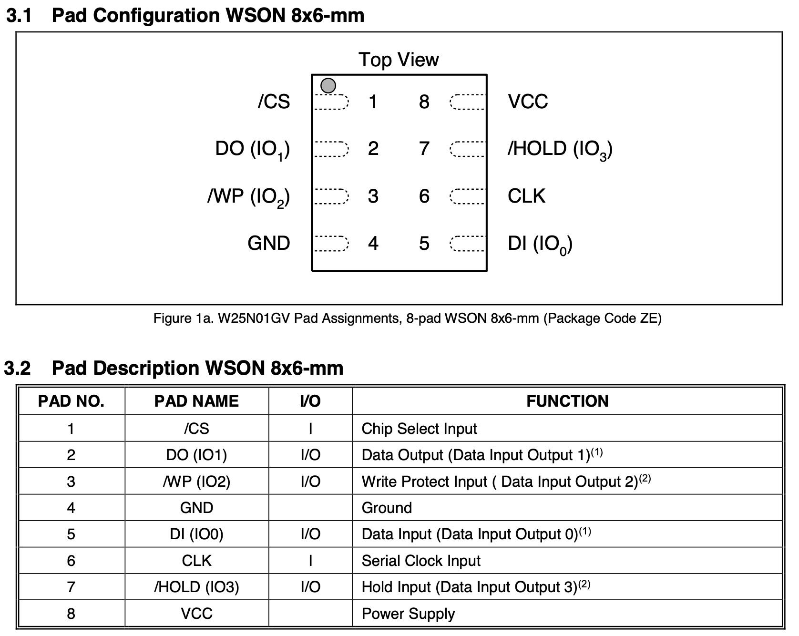
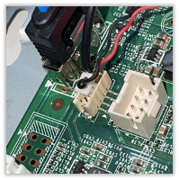
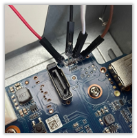
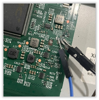
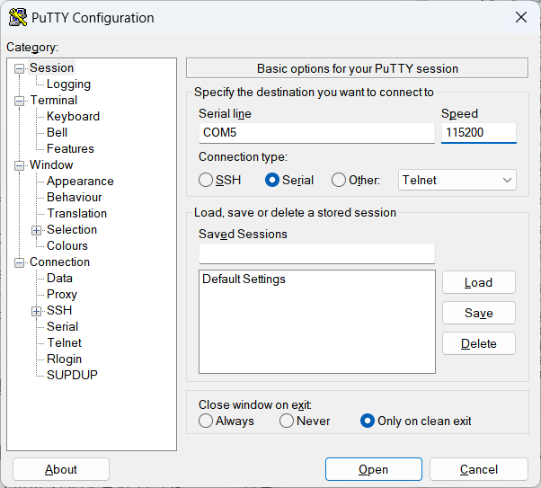
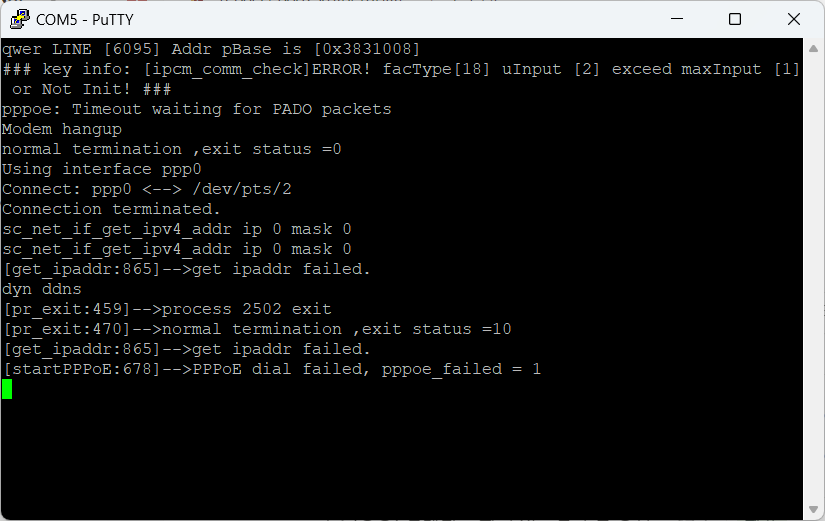
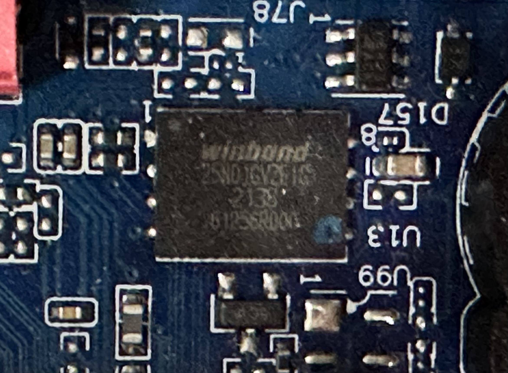
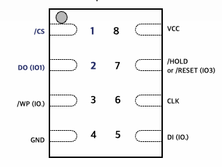
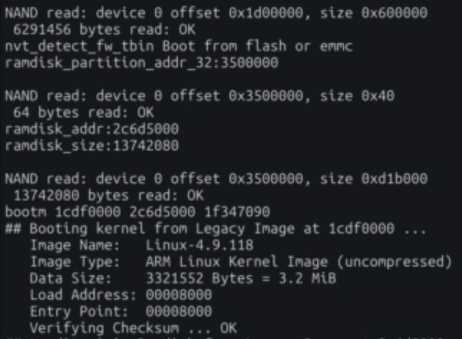
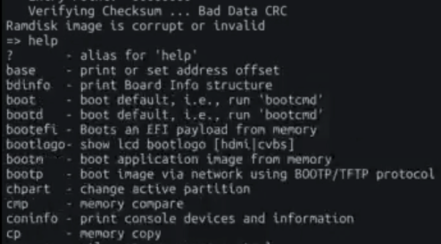

# Firmware Extraction Methodology

## 1. Summary

***

This document is a team that carried out the BoB 12th "NVR Vulnability Analysis" project.This is a report described by ENVY (Kim Chan-in, Park Myung-hoon, Shin Myung-jin, Yang Gang-min, and Lee Yu-kyeong) on the firmware extraction methodology.

Before analyzing the vulnerabilities of embedded devices, one of the key steps is firmware extraction. If firmware is not obtained, it may be difficult to find vulnerabilities with the black box approach. Therefore, in this report, as the first step on how to extract firmware from embedded devices, we would like to present a methodology on what procedures to follow.

Since the purpose of firmware extraction is white box-based vulnerability analysis, file system and major binary acquisition can be viewed as criteria for firmware extraction.

There are two ways to obtain the file system as follows, and this report describes the acquisition of Kernel Shell and extraction of the file system through UART serial communication.

1. Flash Memory dump
2. Obtaining Kernel Shell

## 2. PCB Analysis

***

In embedded equipment, a printed circuit board (PCB) is an integrated circuit that collects various parts such as CPU, RAM, and flash memory, and operates as a single computer and performs the core functions of embedded equipment.

In order to obtain a Flash Memory dump or Kernel Shell, the chip type and debugging port must be identified, so PCB analysis before firmware extraction must be preceded.

<figure><figcaption></figcaption></figure>

### 2.1. Check Flash Memory

#### 2.1.1. Identify Flash Memory

<figure><figcaption></figcaption></figure>

There are generally four types of flash memory used by embedded devices, and information such as manufacturers, chip types, and serial numbers can be checked on the chip surface.

When the above SOP or SON chip is used as a flash memory on the PCB, it is easily identified in the process of checking the manufacturer and chip type of each chip on the PCB. However, if System on Chip (SoC) is used on the PCB, it is impossible to identify Flash Memory on the PCB, and Kernel Shell must be obtained to extract firmware.

#### 2.1.2. Check Datasheet

After identifying Flash Memory, Datasheet can be checked through the manufacturer and chip type.

<figure><figcaption></figcaption></figure>

<figure><figcaption></figcaption></figure>

### 2.2. Verifying UART Pin Existence

Universal Asynchronous Receiver Transmitter (UART) is the simplest serial communication protocol, used for debugging purposes, and can obtain Bootloader Shell and Kernel Shell through serial communication.

The types of pins used by UART are as follows.

| GND | VCC        | RX           | TX        |
| --- | ---------- | ------------ | --------- |
| 0V  | 3.3V or 5V | Receive data | Send data |

UART pins are mainly composed of four continuous pins on the PCB, and TX and RX are sometimes marked on the PCB.

After identifying candidates composed of four consecutive pins on the PCB, actual UART pins may be identified through a multi-tester and signal analyzer.



## 3. UART pin identification

***

After confirming the UART candidate group through PCB analysis, GND, VCC, TX, and RX can be identified by measuring voltage and current.

Although the use of a signal analyzer is required for accurate pin identification, since UART pins can be roughly identified with light-emitting diodes alone, this report describes how to identify pins using multi-testers and light-emitting diodes.

### 3.1. multi-tester

Multi-tester is a device that can measure voltage, current, and resistance and is used to identify GND among UART pins.

If you connect each pin to the positive (+) and negative (-) of the multi-tester, you can check the voltage shown in the table as follows. Since GND has a potential of 0v, if the result of the multi-tester is 3.3v, the pin connected to the cathode can be determined to be a definite GND.

For the other three pins, the voltage may all be the same at 3.3v, or only one pin may be 3.3v. VCC is 3.3v, so if only one pin is 3.3v, it can be suspected that the pin is VCC.

|         | VCC  | TX          | RX          | GND   |
| ------- | ---- | ----------- | ----------- | ----- |
| voltage | 3.3V | 3.3V or Low | 3.3V or Low | -3.3V |

### 3.2. light-emitting diode

After identifying GND, VCC, TX, and RX can be identified using light-emitting diodes.

Since VCC has the highest voltage and current, it can be determined that VCC is the pin that emits the strongest light when connecting the light emitting diode.


In the case of a TX pin, since it is a pin that transmits data, it can be distinguished from RX using the characteristics of the pin.

Various data passes through the TX pin in the process of initializing the device when booting the embedded equipment, and the light continues to flicker when the light emitting diode is connected because the current of the TX pin continues to change in the process. That is, a pin in which the light of the light emitting diode intermittently blinks immediately after the device is booted may be determined as TX.

The above is summarized in the table below.

| GND | VCC        | TX                                                                                     | RX           |
| --- | ---------- | -------------------------------------------------------------------------------------- | ------------ |
| 0V  | 3.3V or 5V | Pin on which the light emitting diode flashes intermittently when the device is booted | one pin left |

### 3.3. Serial communication attempt

After identifying all UART pins, wires must be connected to each pin using soldering or connectors, and converters such as serial-to-usb are required for serial communication.

<figure><figcaption></figcaption></figure>

The role of each pin in serial-to-usb is as follows.

| Black | Green | White | Red |
| ----- | ----- | ----- | --- |
| GND   | TX    | RX    | VCC |

There is a caveat when connecting the UART pin and serial-to-usb of the device. GND and VCC can be connected to each pin, but TX and RX are pins used for data transmission and reception, so the TX of the embedded device must be connected to the RX of the converter and the RX of the embedded device must be connected to the TX of the converter.

After connecting all the pins, you can check the name of the usb device through the device manager after connecting usb to the PC.

<figure><figcaption></figcaption></figure>

<figure><figcaption></figcaption></figure>

After checking the device name, serial communication is possible through putty. At this time, "boadrate (speed)" should be designated, and "boadrate" means the communication speed between the embedded equipment and the PC. It mainly uses 115200 a lot, and if the output is not properly visible during serial communication, the load rate must be changed.

<figure><figcaption></figcaption></figure>

<figure><figcaption></figcaption></figure>

## 4. Bootloader Shell Analysis

***

### 4.1. Bootloader shell connection

When booting the device after UART serial communication, the U-Boot log and the kernel boot log can be checked through the terminal.

```bash
Load STORAGE SPINAND
ROSC: 00ff threshold: 0100
Set VCORE to 1.0V
D-03 Infinity2_DDR3_32_8X_CL14_2133_EXT_Nanya_20181203-F6.h
EXT_NYA2133_20181203-F6 0xf9db
start miu_trim
              start AUTO phase
CPU_1400Mhz
Set CPUCORE to 1.05V
BootSource: HW boot

[IPL] config dram size as 0x40000000
BIST0_0001-OK
IPL gd34accb
Enable MMU and CACHE
Load UBOOT from SPINAND
 -Verify UBOOT CRC32!
  decomp_size=0x0010f9e8


U-Boot 2015.01-svn5523 (Aug 20 2021 - 14:44:20), Build: jenkins-GSP_DH3.RD003992_SSR650G_linux-382

Version: I2g#######
I2C:   ready
DRAM:  1 GiB
WARNING: Caches not enabled
Spinand Device(0xEF), (0xAA), (0x21), 128 MiB
In:    serial
Out:   serial
Err:   serial
Auto-Negotiation...
AN failLink Status Speed:10 Full-duplex:0
Status Error!
mstar_emac
```

During U-Boot execution, you can check the following script in the boot log, and at that point, you can access the Bootloader Shell using a specific magic key.

```bash
Hit any key to stop autoboot:  0
MStar #
```

There may be several types of magic keys depending on the chip manufacturer, and there may be the following.

* Enter any keyboard
* ctrl+u
* shift+8

In most cases, the Bootloader Shell can be accessed only with the input of the magic key, but if the bootdelay environment variable is set to 0 or Secure UART is applied, a method such as Side Channel Attack should be used. The method will be covered in detail in 5.1.

### 4.2. Check Environment Variables

After acquiring the Bootloader Shell, you can check the list of available commands using the help command, and you can check the list of environmental variables used at boot time through the printenv command.

```
$ printenv
DEVID=DHI-NVR4104HS-P-4KS2/L
HWID=00000000000000
ID=7L073F4PAZ3269F
ID1=7L073F4PAZ3269F
PRODUCTID=000000000000000000
appauto=1
authcode=000000
autogw=192.168.1.1
autolip=192.168.1.108
autonm=255.255.255.0
autosip=192.168.254.254
baudrate=115200
board_sn=000000000000
bootargs=console=ttyS0 root=/dev/mtdblock3 rootfstype=squashfs ro init=/linuxrc LX_MEM=0x3D000000 mma_heap=mma_heap_name0,miu=0,sz=0x6000000 mma_heap=mma_heap_low_memory,miu=0,sz=0xF000000,max_off=0x1E000000 resolution=DACOUT_1080P_60 mtdparts=nand0:0x140000@0x000000(param),4m(uboot),2m(env),49408k(romfs),2m(custom),15m(web),2m(logo),512k(dgs),41m(ext_usr),2m(config_fw),-(config)
bootcmd=bootlogo; fb_needreset; usbupdate; autoup; fsload;
bootdelay=1
da=tftp u-boot.bin.img; flwrite
dbgLevel=DEBUG
dc=tftp custom-x.squashfs.img; flwrite
deviceid=000000000000000000
dgbLevel=BOOTTIME
dh_keyboard=1
dl=tftp logo-x.squashfs.img; flwrite
dp=tftp param.bin.img; flwrite
dr=tftp romfs-x.squashfs.img; flwrite
du=tftp eusr-x.squashfs.img; flwrite
dw=tftp web-x.squashfs.img; flwrite
encrypbackup=mac[c0:39:5a:44:96:2f]id[7L073F4PAZ3269F]
eracfg_flag=0
eth1addr=A0:BD:1D:B4:AB:C2
eth2addr=A0:BD:1D:B4:AB:C3
ethact=mstar_emac
ethaddr=c0:39:5a:44:96:2f
gatewayip=255.255.255.255
ipaddr=255.255.255.255
key=000000000000000000
load_modules=1
mtdids=nand0=nand0
mtdparts=mtdparts=nand0:0x140000@0x000000(param),4m(uboot),2m(env),49408k(romfs),2m(custom),15m(web),2m(logo),512k(dgs),41m(ext_usr),2m(config_fw),-(config)
```

The list of available commands may include "nand" or "md" commands used for memory dumps, and among the environment variables, there may be environment variables related to kernel boot mode or kernel log output.

```bash
$ help
?       - alias for 'help'
autoup  - load update file from server
boot    - boot default, i.e., run 'bootcmd'
bootlogo- show bootlogo
bootm   - boot application image from memory
cacheTest- Test cache
chpart  - change active partition
dbg     - set debug message level. Default level is INFO
debug   - Disable uart rx via PAD_DDCA to use debug tool
devid   - devid      - set hardware id and save to flash

ebist   - PHY loopback test
edump   - EMAC Register settings dump
eeprom  - EEPROM sub-system
eloopback- Long loopback test
envbperase- erase env flash region
envbppri- print environment variables
epd     - emac power down
eracfg  - eracfg - erase config sectors

eralogo - eralogo - erase logo sectors

estar   - script via network
estart  - EMAC start
ewavetest- EMAC wave test
fb_needreset- get_key     - get shift key

fb_set  - fb_set     - get shift key

fsload  - fsload	- load binary file from a filesystem image

get_key - get_key     - get shift key

gpio    - Config gpio port
help    - print command description/usage
i2c     - I2C sub-system
i2c_ahd_test- i2c_ahd_test [id] [data]
i2c_imx_rtest- i2c_imx_rtest [id]]
i2c_imx_test- i2c_imx_test [id] [data]
i2c_mipi_rtest- do_mipi_rtest [id] [reg]
i2c_mipi_test- do_mipi_test [id] [data] [reg]
initDbgLevel- Initial varaible 'dbgLevel'
kaimendaji-      - kai men da ji

lcd_on  - lcd_on
lock_otp- lock_otp - otp lock

lock_status- lock_status - get otp lock status

mac     - mac      - set mac address and save to flash

mac1    - mac1      - set mac1 address and save to flash

macaddr - setup EMAC MAC addr
mdio    - mdio   - Ralink PHY register R/W command !!
mii     - MII utility commands
mtdparts- define flash/nand partitions
mxp     - MXP function for Mstar MXP partition
nand    - NAND sub-system
nandops - flwrite - write img data into FLASH from memory

nbist   - PHY loopback test (NOE)
nboot   - boot from NAND device
noe_dump_reg- noe_dump_reg   - Dump NOE relevant register !!
noe_ewave- NOE ewave commands
noe_macaddr- setup NOE MAC addr
noe_phyaddr- NOE PHY commands
noe_pinmux- NOE pinmux commands
nstart  - NOE start
otp_printf- otp_printf - printf otp value

ping    - send ICMP ECHO_REQUEST to network host
pwm     - id:0-7 duty:0-100 period:2~262143
readcis - Read cis block content
reset   - Perform RESET of the CPU
riu     - riu  - riu command
run     - run commands in an environment variable
saveenv - save environment variables to persistent storage
setenv  - set environment variables
sfbin   - for uploading sf image to a server(via network using TFTP protocol)
show_hello-      - hello world

srcfg   - sensor pin and mclk configuration.
uart    - UART sub-system
usbstar - script via USB package
usbupdate- usbupdate     - update the system via USB_DISK, without console

ustar   - script via USB
version - print monitor, compiler and linker version
writecis- Search CIS in dram then write to spinand.
xhprint -      - hello world

xhprintenv- print environment variables
```

### 4.3. Obtain Shell

In the Bootloader Shell, the kernel shell may be obtained by changing the factors of the environmental variables that are handed over when the kernel is booted. The environmental variable usually exists under the name "bootargs", and may be another environmental variable with "args" depending on the file system or U-Boot used.

The form of "bootargs" is as follows, and after the file system is executed, the binary specified in the init factor is executed first. If the content of the init factor is changed to "/bin/sh", the kernel shell may be acquired because the command "/bin/sh" is executed instead of the service being executed after the kernel is booted. If the embedded device uses ramfs, the "/bin/sh" content should be added by adding the "rdinit" factor instead of the "init" factor.

```bash
console=ttyS0 root=/dev/mtdblock3 rootfstype=squashfs ro init=/linuxrc LX_MEM=0x3D000000 mma_heap=mma_heap_name0,miu=0,sz=0x6000000 mma_heap=mma_heap_low_memory,miu=0,sz=0xF000000,max_off=0x1E000000 resolution=DACOUT_1080P_60 mtdparts=nand0:0x140000@0x000000(param),4m(uboot),2m(env),49408k(romfs),2m(custom),15m(web),2m(logo),512k(dgs),41m(ext_usr),2m(config_fw),-(config)
```

If Kernel Shell does not run even though both "init" and "rdinit" factors are changed to "/bin/sh", the service may be automatically executed immediately after Kernel Shell is executed, making interaction impossible. In this case, "single init" or "single rdinit" can be used to set only the "/bin/sh" binary to be executed when the kernel is executed.

If Kernel Shell is not obtained even by the above method, it is possible that the manufacturer used environmental variables to block the output of the Kernel Shell prompt. The solution to the problem will be described in more detail in 5.4.

## 5. Issues and detours

***

If a user acquires a Kernel Shell, it may be difficult for manufacturers to acquire Kernel Shell using various methods because it is possible to acquire a file system as well as identify the operation of the device and analyze major binaries.

This text deals with issues that may arise in the process from Bootloader Shell access to Kernel Shell acquisition and bypass methods in each case.

### 5.1. Glitch Attack

In order to acquire the Kernel Shell from a normal embedded device, it is essential to access the Bootloader Shell because the environmental variable that is handed over to the kernel at boot time must be changed. Therefore, manufacturers sometimes use several methods to block access to the Bootloader Shell.

In order to access the Bootloader Shell from U-Boot, you need to enter the magic key before "bootdelay" becomes zero, but before the product is released, the value of "autoboot" is changed to a value of zero or less to prevent the input of the magic key, or to prevent access to the Bootloader Shell by requiring separate authentication when entering the magic key through Secure UART application.

Glitch Attack is a method that can be used in the above cases.

Glitch Attack is one of the Side Channel Attack types, which creates unexpected behavior by applying electrical interference to the chip.

If you use Glitch Attack, you can access the Bootloader Shell by bypassing Secure UART, etc.

#### 5.1.1. Analysis of U-Boot Behavior

If you check the source code of U-Boot, the autoboot\_command() function is executed and automatically booted.

```c
void main_loop(void)
{
	const char *s;

	bootstage_mark_name(BOOTSTAGE_ID_MAIN_LOOP, "main_loop");

	if (IS_ENABLED(CONFIG_VERSION_VARIABLE))
		env_set("ver", version_string);  /* set version variable */

	cli_init();

	if (IS_ENABLED(CONFIG_USE_PREBOOT))
		run_preboot_environment_command();

	if (IS_ENABLED(CONFIG_UPDATE_TFTP))
		update_tftp(0UL, NULL, NULL);

	if (IS_ENABLED(CONFIG_EFI_CAPSULE_ON_DISK_EARLY)) {
		/* efi_init_early() already called */
		if (efi_init_obj_list() == EFI_SUCCESS)
			efi_launch_capsules();
	}

	s = bootdelay_process();
	if (cli_process_fdt(&s))
		cli_secure_boot_cmd(s);

	autoboot_command(s);

	cli_loop();
	panic("No CLI available");
}
```

In the autoboot\_command() function, after checking whether the magic key is input in the abortboot() function, if Secure UART is applied, logic requiring authentication is executed, and if the magic key is not input, the run\_command\_list() function is executed.

In the run\_command\_list() function, instructions specified in the "bootcmd" environment variable are executed sequentially, and tasks such as loading the kernel and loading the file system are performed.

However, if an error occurs while executing the run\_command\_list() function, the run\_command\_list() and autoboot\_command() functions are returned before booting is completed because there is no logic related to error processing, and the cli\_loop() function executing the Bootloader Shell in the main\_loop() function is executed.

```c
void autoboot_command(const char *s)
{
	debug("### main_loop: bootcmd=\"%s\"\n", s ? s : "<UNDEFINED>");

	if (s && (stored_bootdelay == -2 ||
		 (stored_bootdelay != -1 && !abortboot(stored_bootdelay)))) {
		bool lock;
		int prev;

		lock = autoboot_keyed() &&
			!IS_ENABLED(CONFIG_AUTOBOOT_KEYED_CTRLC);
		if (lock)
			prev = disable_ctrlc(1); /* disable Ctrl-C checking */

		run_command_list(s, -1, 0);

		if (lock)
			disable_ctrlc(prev);	/* restore Ctrl-C checking */
	}

	if (IS_ENABLED(CONFIG_AUTOBOOT_USE_MENUKEY) &&
	    menukey == AUTOBOOT_MENUKEY) {
		s = env_get("menucmd");
		if (s)
			run_command_list(s, -1, 0);
	}
}
```

#### 5.1.2. Analysis of kernel boot process

At this time, Glitch Attack may be used as a way to cause an error.

The normal kernel booting process in the embedded equipment is shown in the left figure below. When the run\_command\_list() function is executed in U-Boot, the kernel compressed image in Flash Memory is read to RAM, and the CPU decompresses the data to execute the kernel.

However, when the kernel compressed image is read from the flash memory, as shown in the figure on the right, if electrical interference is applied to the flash memory through gliding, abnormal data is uploaded to the RAM, and an error occurs while the CPU decompresses the data.


#### 5.1.3. How to attack

Glitch Attack can be performed by connecting the CS (Chip Select) pin and the DO (Data Out) pin of Flash Memory using a conductor at the moment of loading the kernel compression image into RAM during the booting process, as mentioned in the kernel booting process analysis.



By checking the boot log after UART serial communication, the moment when data is read from the flash memory can be identified.

<figure><figcaption></figcaption></figure>

After a few seconds, when the conductor connected to the pin is removed, an abnormal kernel compression image is loaded into the RAM, and an error occurs in the process of decompressing the data, causing the Bootloader Shell to execute.

Afterwards, commands such as "help" or "printenv" can be executed.

<figure><figcaption></figcaption></figure>

### 5.2. OS Command Injection(1)

After accessing the Bootloader Shell, commands such as "help" or "printenv" can be executed in normal cases. However, there are cases in which manufacturers modify the code of U-Boot and cannot use some commands. In this case, since commands such as "printenv" or "md" cannot be used, it is impossible to check environment variables or dump memory.

If the environmental variable is modified to obtain Kernel Shell, the contents of the original "bootargs" environmental variable must be checked because the existing boot process must be maintained. However, if the "printenv" command does not exist, the content of the original environmental variable cannot be confirmed, so the content of the environmental variable cannot be changed.

If the content of the environmental variable cannot be confirmed in this way, the "setenv" command can be used instead. Among the Bootloader Shell commands, the "setenv" command is a command that sets an environment variable, and the content of the set environment variable can be checked through the log output when the command is executed.

```bash
 $ printenv
Unknown command 'printenv' - try 'help'
 $ setenv bootargs $(bootargs)
console=ttyS0 root=/dev/mtdblock3 rootfstype=squashfs ro init=/linuxrc LX_MEM=0x3D000000 mma_heap=mma_heap_name0,miu=0,sz=0x6000000 mma_heap=mma_heap_low_memory,miu=0,sz=0xF000000,max_off=0x1E000000 resolution=DACOUT_1080P_60 mtdparts=nand0:0x140000@0x000000(param),4m(uboot),2m(env),49408k(romfs),2m(custom),15m(web),2m(logo),512k(dgs),41m(ext_usr),2m(config_fw),-(config)
```

After confirming the environmental variable, Kernel Shell can be obtained by changing the "init" or "rdinit" factor.

### 5.3. OS Command Injection(2)

Unlike the case where only limited commands can be executed, there are cases where no Bootloader Shell command works at all. In this case, only some specific commands, such as "debug" or "shell," can be executed, and authentication that only the manufacturer knows is required when entering the command.

```bash
Hit ctrl+u to stop autoboot:  0 
 $ help
 $ printenv
 $ debug
password : 
```

If the bootloader shell prevents the execution of the command, if there is a vulnerability in filtering the command, the filtering may be bypassed using command injection. As mentioned in 5.2, the "setenv" command outputs the execution result through the log, so if the "setenv" command is executable and command injection occurs, the execution result of other commands can be checked using semicolon(;).

```bash
 $ setenv ';help'
?       - alias for 'help'
bootm   - boot application image from memory
ddr     - ddr training function
getinfo - print hardware information
go      - start application at address 'addr'
help    - print command description/usage
md      - memory display
mii     - MII utility commands
mm      - memory modify (auto-incrementing address)
mw      - memory write (fill)
ping    - send ICMP ECHO_REQUEST to network host
printenv- print environment variables
reset   - Perform RESET of the CPU
run     - run commands in an environment variable
saveenv - save environment variables to persistent storage
setenv  - set environment variables
tftp    - tftp	- download or upload image via network using TFTP protocol
version - print monitor version
 $
```

The "bootargs" environment variable can be identified using the bypass method, and Kernel Shell can be obtained after modifying the environment variable.

```bash
 $ setenv ';printenv bootargs'
bootargs=mem=256M console=ttyS0,115200n8 init=/linuxrc
 $ setenv ';setenv bootargs mem=256M console=ttyS0,115200n8 single init=/bin/sh'
bootargs=mem=256M console=ttyS0,115200n8 single init=/bin/sh
 $ setenv ';saveenv'
 $ setenv ';reset'
```

### 5.4. Changing the Kernel Log Output Mode

Even if you access the Bootloader Shell and correct the environment variables properly, you may not be able to check the Kernel Shell prompt. In this case, if all outputs including the boot log as well as the prompt cannot be checked, it is possible that the manufacturer blocked the log output.

In normal cases, a lot of logs are output as the kernel and service binary are executed, but if the log output is blocked, the log cannot be checked after the kernel is executed. In this case, there is a high possibility that there is a kernel log output mode and an environmental variable. It is mainly an environmental variable whose value is set to 0 or 1, and the log output can be checked by modifying the environmental variable.

```bash
 $ $(dh_keyboard)
Unknown command '1' - try 'help'
```

However, even if environmental variables related to the kernel log output mode are found, they cannot be changed through the general "setenv" command. In this case, the "-f" option can be used to force a change in the value.

```bash
 $ setenv -f dh_keyboard 0
```

If the changed environmental variable is related to the actual log output, you can check the Kernel Shell prompt after changing the contents of the "bootargs" environmental variable.

## 6. File system extraction

If Kernel Shell is obtained, file system extraction is essential for major binary and related library reverse engineering.

File system extraction can be divided into two main ways.

* Obtaining a file system from the update firmware
* Obtain a file system from a practical machine

Some manufacturers encrypt and distribute all firmware, making it difficult to extract the file system.

Since practical machines are sold including decoding logic in each product for normal service driving, the file system may be extracted by analyzing the corresponding part, or the file system may be extracted by copying it to the analyst's storage device after the decoding is finished.

This table of contents describes a methodology for moving the file system from the practical machine to the storage device after the decoding logic is finished.

### 6.1. Extraction with xfs

In the process of mounting USB in the embedded device, in the case of a specific file system, the mount may be blocked at the kernel end. In this case, a method of bypassing the protection policy will be described.

The use of hard disks in certain devices, such as NVR, is essential. However, if you connect a USB device as shown in the picture below, it was impossible to extract the file system through USB because the number is blocked from the kernel.

```bash
usb 1-1: new high-speed USB device number 2 using ehci-nvtivot
usb-storage 1-1:1.0: USB Mass Storage device detected
scsi host1: usb-storage 1-1:1.0
scsi 1:0:0:0: Direct-Access     VendorCo ProductCode      2.00 PQ: 0 ANSI: 4
sd 1:0:0:0: Attached scsi generic sg1 type 0
sd 1:0:0:0: [sdb] 30720000 512-byte logical blocks: (15.7 GB/14.6 GiB)
sd 1:0:0:0: [sdb] Write Protect is off
sshdr.sense_key 0, asc 0x0 ascq 0x0
sd 1:0:0:0: [sdb] No Caching mode page found
sd 1:0:0:0: [sdb] Assuming drive cache: write through
 sdb: sdb1
sd 1:0:0:0: [sdb] Attached SCSI removable disk
[GARNET] [2023-11-26 08:49:06] ACTION(add), DEVNAME(/dev/sdb), MODEL(ProductCode), VENDOR(VendorCo)
[GARNET] [2023-11-26 08:49:07] ACTION(add), DEVNAME(/dev/sdb1), MAJOR(sdb)
[GARNET] [2023-11-26 08:49:07] Not Support Mount File System (ntfs)
```

Therefore, after formatting USB as xfs and making it recognized as a hard disk, the file system could be extracted after mounting USB in NVR.

```bash
sh-4.3# mount /dev/sdb1 /envy
XFS (sdb1): EXPERIMENTAL reflink feature enabled. Use at your own risk!
XFS (sdb1): Mounting V5 Filesystem
XFS (sdb1): Starting recovery (logdev: internal)
XFS (sdb1): Ending recovery (logdev: internal)
```

### 6.2. Extraction using nfs

There are cases in which there is no port to connect an external storage device in the device or the actual service codes may not be accessed by virtually mounting the hard disk. The NVR device provides the ability to mount an external NAS server in case the hard disk is physically damaged or full of capacity. It is mounted using iSCSI or NFS file systems and helps external file systems to be used locally. This function is a good solution in difficult situations where hard disks are mounted virtually.

After building your own NFS server, enter the following commands in the Device Shell.

```bash
mount -t nfs -o vers=3,nolock NFS_SERVER_IP:/NFS_PATH ./TARGET_DIR
```

After executing the command, you can check whether the mount has been successful through the mount command, and you can check the files you have configured in the NFS server.

```bash
# mount
192.168.0.103:/volume3/nfs on /nfs type nfs (rw,relatime,vers=3,rsize=8192,wsize=8192,namlen=255,hard,nolock,proto=udp,port=2049,timeo=7,retrans=3,sec=sys,local_lock=all,addr=192.168.0.103)
```

```bash
/nfs # ls
booting        exploit        hikvision_fs   lib            tmp
bin            dahua_fs       grep           info.bin       static_binary  tools
```

After that, "cp -a" commands and options allow you to extract the file system by copying it to your NFS server while maintaining all properties.
