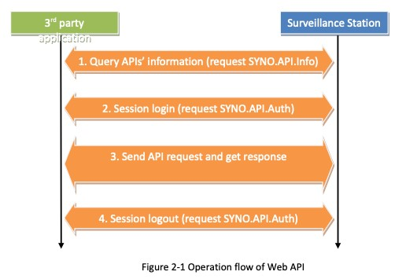

# Binary Analysis Report

## 1. Overview

***

This document is a report described by Team.ENVY (Kim Chan-in, Park Myung-hoon, Shin Myung-jin, Yang Kang-min, and Lee Yoo-kyung) who carried out the BoB 12th NVR Vulnability Analysis project.

### 1.1. Necessity

For the vulnerability analysis of Synology, analysis of the operation method of web services and web APIs is essential. Therefore, for vulnerability analysis, the binary used in Synology's Survey Station is to be analyzed.

## 2. Surveillance Station

***

### 2.1. synoscgi

Synoscgi is a binary used by Surveillance Station.

```
7697 ?        00:00:20   synoscgi
19757 ?        00:00:00     synoscgi
22533 ?        00:00:00     synoscgi
24462 ?        00:00:00     synoscgi
28147 ?        00:00:00     synoscgi
  781 ?        00:00:00     synoscgi
  872 ?        00:00:00     synoscgi
  885 ?        00:00:00     synoscgi
  886 ?        00:00:00     synoscgi
  887 ?        00:00:00     synoscgi
```

As shown in the picture above, when the Survey Station is executed, 10 synoscgis are operated, and the function is performed through the exec function at the request of the user.

```
if (pcVar14 == (char *)0x0) {
LAB_00110ad4:
    pcVar16 = local_628;
    pcVar18 = strstr(local_628,"entry.cgi");
    pcVar14 = local_620;
    if (pcVar18 == (char *)0x0) {
LAB_001112e8:
      pcVar14 = strstr(pcVar16,"index.cgi");
      if (((pcVar14 != (char *)0x0) ||
          (pcVar14 = strstr(pcVar16,"query.cgi"), pcVar14 != (char *)0x0)) ||
         ((pcVar14 = strstr(pcVar16,"security.cgi"), pcVar14 != (char *)0x0 ||
          (pcVar14 = strstr(pcVar16,"encryption.cgi"), pcVar14 != (char *)0x0)))) {
        iVar7 = getpid();
        piVar19 = __errno_location();
        *piVar19 = 1;
        _Var8 = geteuid();
        _Var9 = getegid();
        if ((_Var8 | _Var9) == 0) {
LAB_0011132c:
          *piVar19 = 0;
        }
		...
    execl(local_478,local_478,0);
    uVar21 = __cxa_allocate_exception(0x58);
    FUN_0010a740(auStack_458,"cannot execute cgi, is the cgi a valid executable?");
    local_438 = &PTR_LAB_00131710;
```

Decompiling the synoscgi binary compares whether the path requested by the user is index.cgi, query.cgi, security.cgi, encryption.cgi, and if it is correct, it is executed through the execl function.

At this time, the binary to be executed existed in the following path.

```
root@envy:/var/packages/SurveillanceStation/target/webapi# ls
ActionRule     CMS                GlobalSearch     MobileCam         Stream
AddOns         DetectionEvent     Help             Notification      surveillancestation.auth
Alert          DigitalOutput      HomeMode         PersonalSettings  System
Analytics      DualAuth           Info             Player            TaskQueue
AppCenter      Emap               IOModule         Preload           ThirdParty
Archiving      Encryption         IPSpeaker        PTZ               TimeLapse
AudioOut       Event              IVA              Recording         Transactions
AudioPattern   ExternalDevice     JoystickSetting  RecordingPicker   UserPrivilege
AxisAcsCtrler  ExternalEvent      Layout           ReportCenter      VideoStreaming
C2             ExternalRecording  License          Share             Webhook
Camera         Face               LocalDisplay     SnapShot          YoutubeLive
CameraCap      Fisheye            Log              Sort
```

The name of the directory that exists in that directory represents the name of the API, and the binary that runs exists in the so file in the src directory in the API directory.

### 2.2. request

<figure><figcaption></figcaption></figure>

According to Synology's Web API document, the user logs in using the SYNO.API.Auth API and then performs the desired function using another API.

```
GET /webapi/<URL_PATH>? api=<API>&method=<METHOD>&version=<VERSION>[&_sid=<SESSION_ID>][&<PARAM_LIST>]
```

When sending a request, the desired api, method, and version must be entered as above, and additional parameters must be entered according to the method. Synology's web API supports GET requests as above, but also POST requests, so when sending a POST request, the function is performed by sending a request in json form to body data.

<figure><figcaption></figcaption></figure>

If a normal error occurs when sending a request, the code used by Synology is returned rather than the HTTP status code.
